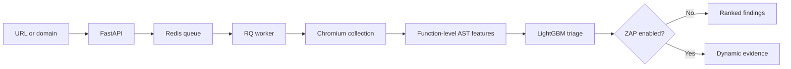

# DOM XSS Pipeline

[](https://github.com/Layansabha/DOM-XSS/actions/workflows/ci.yml)
[](LICENSE)

An end-to-end pipeline for prioritizing potential DOM-based XSS in a page or
same-origin domain. It renders the target in Chromium, collects the JavaScript
the browser sees, ranks function-level code with LightGBM, and can run OWASP
ZAP for authorized dynamic verification.

The machine-learning stage is a triage layer. It narrows the code that deserves
review; it does not claim that a score alone proves exploitability or safety.

[Quick start](#quick-start) ·
[Using the scanner](#using-the-scanner) ·
[Operational design](#operational-design) ·
[Monitoring](#application-monitoring) ·
[How it works](docs/PIPELINE.md) ·
[Model and research](docs/MODEL-AND-RESEARCH.md) ·
[Full user guide](docs/USAGE.md)

> Use this project only on systems you own or are explicitly authorized to test.

## Pipeline



## What it does

- Accepts a single page or performs a bounded same-origin crawl.
- Collects scripts from the original response, rendered DOM, event handlers,
  loaded resources, and Chromium `Debugger.scriptParsed` events.
- Captures runtime-created sources such as `eval` and `new Function` when the
  browser parses them during the visit.
- Splits JavaScript into bounded function-sized units and converts each unit
  into AST-token frequencies.
- Applies the pinned 500-feature vocabulary and native LightGBM model from
  [`Layansabha/Dom-xss-ML`](https://github.com/Layansabha/Dom-xss-ML).
- Refuses to score units with zero vocabulary coverage.
- Optionally runs OWASP ZAP Client Spider and active DOM-XSS rule `40026`.
- Executes scans asynchronously through Redis and RQ and exposes progress
  through a web UI and REST API.

## Quick start

Requirements:

- Docker Engine with Docker Compose v2
- Git
- at least 6 GB of available RAM when ZAP is enabled

On Kali Linux:

```bash
sudo apt update
sudo apt install -y docker.io docker-compose git
sudo systemctl enable --now docker
sudo usermod -aG docker "$USER"
newgrp docker

git clone https://github.com/Layansabha/DOM-XSS.git
cd DOM-XSS
cp .env.example .env
```

Start the default ML-only stack:

```bash
docker compose up --build -d --remove-orphans
curl -fsS http://127.0.0.1:8000/readyz
```

Open `http://127.0.0.1:8000`.

This starts the API, worker, Redis, and Chromium-based collection without
downloading or running ZAP.

For authorized dynamic verification, generate an API key, place it in `.env` as
`ZAP_API_KEY`, and start the ZAP override:

```bash
openssl rand -hex 32
docker compose -f compose.yaml -f deploy/compose.zap.yaml up --build -d --remove-orphans
```

ZAP is intentionally opt-in because its image and runtime memory are not needed
for ML-only triage.

## Using the scanner

| Mode | Behaviour |
|---|---|
| `Auto` | Treats a root URL as a domain scan and a URL with a path as one page. |
| `Domain crawl` | Follows safe same-origin links within page and depth limits. |
| `Single page` | Analyses only the submitted URL. |

The ZAP checkbox is disabled in the default ML-only deployment. Start the ZAP
override to make it available, and enable it only for an authorized target;
active scanning sends test payloads and can change application state.

The same workflow is available through the API:

```bash
curl -sS -X POST http://127.0.0.1:8000/api/scans \
  -H 'Content-Type: application/json' \
  -d '{
    "target_url": "https://example.com/path",
    "scope_mode": "page",
    "dynamic_verification": false
  }'
```

The API returns `202 Accepted` with a `status_url`. Interactive API
documentation is available at `/docs`.

## Reading results correctly

| Result | Interpretation |
|---|---|
| **ML score** | Relative ranking for the highest-scoring code unit, not a calibrated exploit probability. |
| **High priority** | The score crossed `ML_THRESHOLD` and should be reviewed or dynamically tested. |
| **Feature coverage** | Share of extracted AST-token occurrences represented in the model vocabulary. |
| **Insufficient coverage** | No code unit had a meaningful vocabulary match, so no ML decision was made. |
| **Client-side detection** | ZAP browser-side evidence that still requires analyst reproduction. |
| **Actively confirmed** | ZAP active rule `40026` returned reproducible scanner evidence. |

A low score does not prove the page is safe. A high score without dynamic
evidence is a triage finding, not a confirmed vulnerability.

## Operational design

The DevOps work in this repository is intentionally focused on operating this
specific workload rather than adding tools for their own sake.

### Asynchronous execution

Long-running browser and security-analysis work does not execute inside the API
request. FastAPI validates the request, applies queue-capacity limits, enqueues
an RQ job, and returns immediately. The worker performs the scan and stores the
result in Redis.

This keeps the API responsive and makes API health, queue health, and worker
health independently observable.

### Container design

- multi-stage application image
- non-root runtime user
- read-only API and worker filesystems
- dropped Linux capabilities and `no-new-privileges`
- service health checks
- Redis persistence
- optional ZAP service pinned to version `2.17.0` and an immutable image digest
- localhost-only API binding by default
- Redis and ZAP ports not published to the host

### Health and readiness

- `/healthz` verifies that the API process responds.
- `/readyz` verifies Redis access and model availability.
- the worker health check verifies Redis connectivity and that the RQ process is
  running.

A responsive API does not automatically mean that queued scans are being
processed. Worker health and queue depth are monitored separately.

### Structured logs

API and worker logs are JSON records written to stdout. They include operational
context such as `request_id`, `job_id`, `stage`, `status`, duration,
`request_host`, `target_host`, and `error_type`.

The API returns `X-Request-ID`, allowing requests to be correlated with logs.

## Application monitoring

Prometheus and Grafana are available through an optional Compose override:

```bash
make monitor-up
```

To run monitoring together with ZAP:

```bash
make monitor-up-zap
```

Default endpoints:

- application: `http://127.0.0.1:8000`
- Prometheus: `http://127.0.0.1:9090`
- Grafana: `http://127.0.0.1:3000`

The `/metrics` endpoint exposes:

- HTTP request count and latency
- Redis metrics availability
- queue depth
- registered RQ workers
- queued, completed, and failed scans
- pages collected
- ZAP failures
- scan-duration count and total

The provisioned **DOM XSS Operations** dashboard shows API p95 latency, queue
pressure, worker availability, scan outcomes, average scan duration, and
pipeline activity.

The previous privileged cAdvisor container and generic CPU/RAM dashboard were
removed. The monitoring layer now measures application behaviour directly.

## CI and end-to-end validation

The GitHub Actions workflow has three validation stages:

1. **Quality:** Ruff, mypy, pytest, and pip-audit.
2. **Infrastructure:** Terraform formatting, validation, and tests.
3. **Container:** Compose validation, image build, model smoke test, worker smoke
   test, end-to-end scan, and Trivy image scanning.

The end-to-end test starts the API, worker, Redis, and a safe local test target,
submits a real scan, waits for the asynchronous job to finish, validates the
result, and checks the metrics endpoint. On failure, CI prints service state and
relevant logs before cleanup.

Run it locally:

```bash
make e2e
```

The command always removes its isolated containers and volumes when it exits.

## Image versions and deployment

Merges to `main` publish:

- `latest` for convenience
- `sha-<commit>` for an immutable code revision

Git tags matching `v*` also publish semantic-version tags such as `v1.0.0` and
`1.0`.

The VPS deployment script rejects `latest` and the local development image. A
VPS deployment must use a version tag, commit tag, or digest, making rollback
explicit and repeatable.

The optional [Terraform reference](infra/terraform/README.md) provisions one
Hetzner Cloud VPS, restricted SSH, HTTP/HTTPS firewall rules, a managed SSH key,
and cloud-init bootstrap. It defaults to a `demo` environment and requires an
explicit release tag or commit instead of mutable `main`.

It is a single-server deployment reference, not a highly available platform.
Applying it creates billable resources.

## Model and research basis

The project is based on the function-level AST bag-of-words idea introduced in
the WWW 2021 paper
[Towards a Lightweight, Hybrid Approach for Detecting DOM XSS Vulnerabilities with Machine Learning](https://www.contrib.andrew.cmu.edu/~liminjia/research/papers/www2021-dom-xss-dnn.pdf)
and its
[CMU DOM XSS dataset](https://kilthub.cmu.edu/articles/dataset/DOM_XSS_Web_Vulnerability_Dataset/13870256).

The deployed classifier is Layan Sabha's LightGBM derivative. It is not the
paper's TensorFlow DNN and does not claim to reproduce the paper's full
web-scale experiment. Training uses a deterministic script-level split, a
vocabulary fitted on training data only, duplicate/conflict removal, and a
strict test containing feature bags unseen by training or validation.

| Threshold | Precision | Recall | F1 | PR-AUC |
|---|---:|---:|---:|---:|
| Validation-selected `0.96085` | 0.9545 | 0.7636 | 0.8485 | 0.9066 |
| Runtime triage `0.50` | 0.8431 | 0.7818 | 0.8113 | 0.9066 |

These are function-level results on the cleaned sampled derivative dataset,
not page-level accuracy on the public web.

The [model and research audit](docs/MODEL-AND-RESEARCH.md) documents what
matches the study, what intentionally differs, and what still needs validation.

## Security controls

- URL normalization, DNS resolution, redirect validation, and browser-request
  checks
- private, loopback, reserved, link-local, and metadata-style target blocking
  by default
- same-origin crawl boundaries and conservative destructive-link filtering
- page, depth, byte, queue, and scan-time limits
- non-root containers and API request-size limits
- commit-pinned model artifacts with SHA verification and no pickle
  deserialization
- dependency auditing, Terraform tests, Compose validation, Trivy scanning, and
  end-to-end testing in CI

For an authorized local lab, set `ALLOW_PRIVATE_TARGETS=true`. Do not enable
that setting on a public deployment.

## Development

```bash
python3 -m venv .venv
source .venv/bin/activate
pip install -e '.[dev]'
playwright install chromium

pytest
ruff check .
mypy app
```

Useful Make targets:

```bash
make up
make up-zap
make down
make test
make lint
make typecheck
make audit
make monitor-up
make monitor-up-zap
make e2e
```

## Current limitations

- Standard Chromium plus Tree-sitter cannot reproduce the study's modified
  Chromium 57/V8 taint instrumentation byte for byte.
- The current model was trained on a cleaned sample; retraining from the raw CMU
  `.xz` release remains the preferred dataset revision.
- Authenticated crawling and custom interaction scripts are not implemented.
- Headless-browser blocking and unvisited interaction-dependent paths can
  reduce coverage.
- Automated ML and ZAP analysis can produce both false positives and false
  negatives.
- The optional VPS design is a single host and does not provide high
  availability or autoscaling.

## License

The application is released under the [MIT License](LICENSE). Model and dataset
sources remain attributed to their respective repositories and research
publication.
