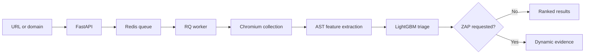

# DOM XSS Pipeline

[](https://github.com/Layansabha/DOM-XSS/actions/workflows/ci.yml)
[](LICENSE)

[Quick start](#quick-start) ·
[Web interface](#option-a-web-interface) ·
[Command line](#option-b-command-line) ·
[How it works](docs/PIPELINE.md) ·
[Model and research](docs/MODEL-AND-RESEARCH.md)

ML-assisted triage for potential DOM-based XSS, with browser-rendered
JavaScript collection and optional OWASP ZAP verification.

The pipeline accepts one page or a bounded same-origin domain, runs the target
in Chromium, extracts function-level AST features, and ranks suspicious code
with LightGBM. Dynamic verification is an explicit opt-in mode for authorized
targets.

> Use this project only on systems you own or are explicitly authorized to
> test. Active verification sends test payloads and may change application
> state.

## Why this project exists

DOM XSS is driven by client-side execution. The relevant JavaScript may be
loaded dynamically, created at runtime, or attached after the initial HTML
response, so searching static HTML alone gives incomplete coverage.

This project combines three stages that are useful for different reasons:

1. **Rendered collection** captures JavaScript observed by a real browser.
2. **ML triage** prioritizes function-level code for investigation.
3. **Optional dynamic analysis** looks for reproducible OWASP ZAP evidence.

The ML score is a ranking signal. It is not a calibrated probability of
exploitation, and a low score does not prove that a page is safe.

## Architecture



Scans run outside the API process. FastAPI validates and queues each request;
an RQ worker performs browser collection, inference, and optional verification.
This keeps long scans from blocking HTTP requests and makes queue and worker
health observable independently.

### What is collected

- scripts in the original response and rendered DOM
- inline event-handler code
- same-origin script resources loaded by the page
- sources reported by Chromium `Debugger.scriptParsed`, including observable
  runtime-created code such as `eval` and `new Function`

Collected code is deduplicated, divided into bounded function-sized units, and
converted to the 4,096-feature vocabulary expected by the deployed LightGBM
model. The feature contract combines normalized AST token counts with
deterministic source/sink co-occurrence features. Units with no vocabulary
coverage are not assigned a misleading score.

For the complete stage-by-stage contract, see
[How the pipeline works](docs/PIPELINE.md).

## Quick start

### Requirements

- Docker Engine
- Docker Compose v2 (`docker compose`)
- Git

On Kali Linux:

```bash
sudo apt update
sudo apt install -y docker.io docker-compose git
sudo systemctl enable --now docker
sudo usermod -aG docker "$USER"
newgrp docker
docker compose version
```

Clone and configure the project:

```bash
git clone https://github.com/Layansabha/DOM-XSS.git
cd DOM-XSS
cp .env.example .env
```

Start the default ML-only stack:

```bash
docker compose up --build -d --remove-orphans
docker compose ps
curl -fsS http://127.0.0.1:8000/readyz
```

Open [http://127.0.0.1:8000](http://127.0.0.1:8000). The first build downloads
the application image layers and Chromium; later starts reuse the local images.
The verified LightGBM bundle is committed in this repository, so building the
application does not depend on downloading a model from another repository.
The default stack does not download or run ZAP.

Stop all application and optional services with:

```bash
make down
```

## Runtime profiles

| Profile | Command | Services | Use it when |
|---|---|---|---|
| ML only | `docker compose up --build -d` | API, worker, Redis | You need browser collection and ML triage. |
| ML + ZAP | `make up-zap` | Base stack plus ZAP | You are authorized to run active verification. |
| Monitoring | `make monitor-up` | Base stack plus Prometheus and Grafana | You need operational metrics and dashboards. |
| Monitoring + ZAP | `make monitor-up-zap` | All optional services | You need both verification and monitoring. |

### Enable ZAP verification

Generate a local API key and store it in `.env`:

```bash
sed -i "s|^ZAP_API_KEY=.*|ZAP_API_KEY=$(openssl rand -hex 32)|" .env
docker compose \
  -f compose.yaml \
  -f deploy/compose/zap.yaml \
  up --build -d --remove-orphans
```

The UI enables its verification checkbox only when the ZAP profile is active.
ZAP uses the Client Spider for browser-side coverage and restricts active
scanning to DOM-XSS rule `40026`. Its image and startup time are intentionally
absent from the default profile.

## Run your first scan

After `/readyz` returns `{"status":"ready"}`, choose either the web interface
or the command-line client. Both submit the same asynchronous pipeline job and
return the same analysis.

| Interface | Best for | Start here |
|---|---|
| **Web interface** | Interactive scans and visual result review | Open `http://127.0.0.1:8000` |
| **Command line** | Kali workflows, repeatable scans, JSON, and automation | Run `docker compose exec -T api domxss health` |

### Option A: Web interface

1. Open [http://127.0.0.1:8000](http://127.0.0.1:8000).
2. Paste an authorized HTTP or HTTPS URL into **Target URL**.
3. Choose a collection scope:
   - **Auto detect** treats a root URL as a domain crawl and a URL with a path
     or query as one page.
   - **Same-origin domain crawl** follows safe links on the same origin within
     the configured limits.
   - **Single page** analyzes only the submitted URL.
4. Leave **Dynamic verification** off for ML-only analysis. The checkbox is
   available only when the optional ZAP profile is running.
5. Select **Run analysis** and wait for the status to reach **Complete**.

The result shows collection completeness, scripts and code units analyzed,
feature coverage, ML priority, risk score, and any ZAP evidence.

### Option B: Command line

The `domxss` client is already installed inside the application image. Check
that the API, Redis, and model are ready:

```bash
docker compose exec -T api domxss health
```

Run one page and print a terminal summary:

```bash
docker compose exec -T api domxss scan \
  https://example.com/path \
  --scope page
```

Scan a bounded same-origin domain:

```bash
docker compose exec -T api domxss scan \
  https://example.com/ \
  --scope domain
```

Add `--json` for machine-readable output:

```bash
docker compose exec -T api domxss scan \
  https://example.com/path \
  --scope page \
  --json
```

For the restricted ZAP rules, start the ZAP profile first and add `--verify`:

```bash
docker compose exec -T api domxss scan \
  https://example.com/path \
  --scope page \
  --verify
```

Run `domxss --help` or `domxss scan --help` for all options. Common automation
options are:

| Option | Behaviour |
|---|---|
| `--detach` | Queue the scan, print its job ID, and return immediately. |
| `domxss status JOB_ID --wait` | Resume monitoring a detached job. |
| `--json` | Print the complete job and result object as JSON. |
| `--fail-on-high-risk` | Return exit status `2` when the pipeline marks at least one page high priority. |
| `--timeout SECONDS` | Set the maximum time the CLI waits for completion. |

Example detached workflow:

```bash
docker compose exec -T api domxss scan \
  https://example.com/path \
  --scope page \
  --detach

docker compose exec -T api domxss status JOB_ID --wait
```

### Scope and target safety

| Scope | Behaviour |
|---|---|
| `auto` | A root URL becomes a domain crawl; a URL with a path or query becomes a single-page scan. |
| `domain` | Follows safe same-origin links within the configured page and depth limits. |
| `page` | Analyzes only the submitted URL. |

Private, loopback, reserved, link-local, and metadata-style destinations are
blocked by default. For an isolated lab you own, set
`ALLOW_PRIVATE_TARGETS=true` in `.env`; do not enable it on a shared or public
deployment.

### Interpret the result

| Field or status | Meaning |
|---|---|
| **Complete / Partial / Failed** | Whether page collection completed fully, returned usable data with warnings, or failed. |
| **ML risk score** | Highest function-level model score on the page; useful for ranking, not proof of exploitation. |
| **High priority** | The model score crossed `ML_THRESHOLD`, a static source/sink pair was observed, or both. Review the decision basis; this is not proof of data flow. |
| **Feature coverage** | Share of extracted token occurrences represented in the model vocabulary. |
| **Insufficient coverage** | No code unit matched the vocabulary well enough to make an ML decision. |
| **Client-side detection** | ZAP browser-side evidence that still needs analyst reproduction. |
| **Confirmed** | ZAP active DOM-XSS rule `40026` returned scanner evidence; verify it before reporting. |

Collection warnings such as an HTTP `403`, an invalid script URL, or a browser
idle timeout mean the scan was partial. They should not be interpreted as a
clean result.

### Direct API access

The web interface and CLI use the same API. Integrations can create a scan
directly:

```bash
curl -fsS -X POST http://127.0.0.1:8000/api/scans \
  -H 'Content-Type: application/json' \
  -d '{
    "target_url": "https://example.com/path",
    "scope_mode": "page",
    "dynamic_verification": false
  }'
```

A valid request returns `202 Accepted`, a job ID, and a `status_url`. Poll that
URL until `state` is `finished` or `failed`. Interactive OpenAPI documentation
is available at [http://127.0.0.1:8000/docs](http://127.0.0.1:8000/docs).

## Repository layout

| Path | Responsibility |
|---|---|
| `app/` | FastAPI application, queue integration, pipeline services, templates, and static assets |
| `artifacts/` | Versioned LightGBM model, vocabulary, metadata, and integrity manifest used at runtime |
| `deploy/compose/` | Optional Compose profiles for ZAP, monitoring, VPS, and end-to-end testing |
| `deploy/caddy/` | Reverse-proxy configuration for the VPS profile |
| `deploy/monitoring/` | Prometheus and Grafana configuration |
| `benchmarks/` | Transparent page-level model regression corpus and its claim boundaries |
| `docs/` | Usage, pipeline, and model documentation |
| `infra/terraform/` | Optional single-VPS Hetzner provisioning |
| `scripts/` | Model bundle preparation/verification, benchmarks, and end-to-end test runner |
| `tests/` | Unit tests and the isolated end-to-end fixture |

## Operations

| Concern | Implementation |
|---|---|
| Long-running work | Redis-backed RQ jobs with queue capacity, timeouts, progress, and result TTLs |
| Runtime isolation | Non-root application image, read-only filesystems, dropped capabilities, and `no-new-privileges` |
| Target safety | URL normalization, DNS and redirect checks, same-origin boundaries, size limits, and private-network blocking by default |
| Health | `/healthz` for the API process, `/readyz` for Redis and model readiness, plus an independent worker health check |
| Observability | JSON logs, `X-Request-ID` correlation, Prometheus metrics, and an optional Grafana dashboard |
| Reproducibility | Repository-versioned model bundle with SHA-256 verification, immutable ZAP image digest, versioned GHCR images, and a deploy script that rejects `latest` |

Important local endpoints:

| Endpoint | Purpose |
|---|---|
| `http://127.0.0.1:8000/healthz` | API liveness |
| `http://127.0.0.1:8000/readyz` | Redis and model readiness |
| `http://127.0.0.1:8000/metrics` | Prometheus-format application metrics |
| `http://127.0.0.1:9090` | Prometheus when monitoring is enabled |
| `http://127.0.0.1:3000` | Grafana when monitoring is enabled |

Operational logs are JSON records written to stdout:

```bash
docker compose logs --no-color --tail=200 api worker redis
```

See the [usage and operations guide](docs/USAGE.md) for diagnostics, metric
names, image tags, and rollback steps.

## Validation and CI

GitHub Actions validates the repository in three stages:

| Stage | Checks |
|---|---|
| Quality | Ruff, mypy, pytest, and `pip-audit` |
| Infrastructure | Terraform formatting, validation, and native tests |
| Container | Compose profile validation, image build, model regression report, worker smoke test, an end-to-end scan, and Trivy scanning |

The end-to-end test starts an isolated local target and the real API, worker,
Redis, Chromium, and LightGBM path. It submits a scan, waits for the asynchronous
result, and checks application metrics. It does not attack a public target and
does not require ZAP.

```bash
make e2e
```

For local development:

```bash
python3 -m venv .venv
source .venv/bin/activate
pip install -e '.[dev]'
playwright install chromium

make lint
make typecheck
make test
make benchmark
make audit
```

`make benchmark` reports page-level confusion counts and metrics for the
versioned hand-labeled regression corpus. It is intentionally diagnostic: the
corpus is synthetic and balanced, so its numbers are not estimates for the
public web. See [the benchmark contract](benchmarks/README.md).

## Deployment

Merges to `main` publish `latest` and an immutable `sha-<commit>` image to
GitHub Container Registry. Tags matching `v*` also publish semantic versions,
such as `v1.0.0` and `1.0`.

The included deployment path targets one Docker Compose VPS:

- Caddy provides automatic HTTPS and HTTP basic authentication.
- `deploy/deploy.sh` requires a version, commit tag, or digest and waits for
  application readiness.
- `ENABLE_ZAP=false` keeps the production profile ML-only; setting it to
  `true` also requires a real `ZAP_API_KEY`.
- The optional [Terraform reference](infra/terraform/README.md) provisions a
  Hetzner Cloud server, firewall rules, SSH key, and cloud-init bootstrap.

This is a single-server reference, not a highly available platform. Applying
the Terraform configuration creates billable resources. Review the
[VPS deployment guide](docs/USAGE.md#optional-vps-deployment) before exposing
the service outside localhost.

## Model and research basis

The pipeline follows the function-level AST bag-of-words direction described
in the WWW 2021 paper
[Towards a Lightweight, Hybrid Approach for Detecting DOM XSS Vulnerabilities with Machine Learning](https://www.contrib.andrew.cmu.edu/~liminjia/research/papers/www2021-dom-xss-dnn.pdf)
and uses a derivative of the
[CMU DOM XSS dataset](https://kilthub.cmu.edu/articles/dataset/DOM_XSS_Web_Vulnerability_Dataset/13870256).

The deployed classifier is Layan Sabha's
[LightGBM derivative](https://github.com/Layansabha/Dom-xss-ML), not the
paper's TensorFlow DNN. Runtime artifacts are prepared from a pinned source
commit and checked for model/vocabulary compatibility before the application
becomes ready.

| Runtime decision at `0.50` | Precision | Recall | F1 | PR-AUC |
|---|---:|---:|---:|---:|
| LightGBM v2 only | 0.8545 | 0.8393 | 0.8468 | 0.9161 |
| Model OR static source/sink signal | 0.7206 | 0.8750 | 0.7903 | — |

The table evaluates the exported model on 3,215 strict test feature bags,
including 56 positives, after a deterministic script-level split. The hybrid
row reports the runtime decision policy separately so its recall gain and
precision cost remain visible. The bundled 12-case page regression suite
currently reports TP=6, FP=1, TN=5, and FN=0; it is a synthetic release
regression, not external validation. See
[Model and research notes](docs/MODEL-AND-RESEARCH.md) for the complete
protocol and limitations.

These are function-level results on a cleaned sampled derivative dataset. They
are not page-level accuracy measurements for the public web and are not the
paper's reported results. The
[model and research audit](docs/MODEL-AND-RESEARCH.md) documents the compatible
parts, deliberate differences, evaluation method, and work required before a
commercial accuracy claim.

## Known limitations

- Modern Chromium plus Tree-sitter does not reproduce the paper's modified
  Chromium 57/V8 taint instrumentation byte for byte.
- The current model was trained from the 87,210 usable rows in the
  CMU-derived positive/negative workbook export; 3,290 Excel-truncated cells
  were rejected rather than parsed as complete feature dictionaries.
- Authenticated crawling and custom interaction scripts are not implemented.
- Bot protection and interaction-dependent paths can reduce collection
  coverage.
- ML and dynamic analysis can produce both false positives and false negatives.
- The provided VPS design has no high availability or autoscaling.

## Documentation

| Document | Contents |
|---|---|
| [Usage and operations](docs/USAGE.md) | Setup, scan modes, API, health, logs, metrics, CI, and VPS deployment |
| [Pipeline internals](docs/PIPELINE.md) | Target policy, crawling, collection, extraction, inference, and verification |
| [Model and research audit](docs/MODEL-AND-RESEARCH.md) | Research alignment, model contract, evaluation, and claim boundaries |
| [Page-level regression benchmark](benchmarks/README.md) | Reproducible diagnostic cases, execution, and limits |
| [Terraform reference](infra/terraform/README.md) | Hetzner inputs, deployment flow, verification, cost, and teardown |
| [Security policy](SECURITY.md) | Authorized use, private reporting, and deployment guidance |

Report bugs and request features through
[GitHub Issues](https://github.com/Layansabha/DOM-XSS/issues). Report security
problems privately as described in the [security policy](SECURITY.md).

## License

The application is released under the [MIT License](LICENSE). Dataset, model,
and research sources remain attributed to their respective authors. Maintained
by [Layan Sabha](https://github.com/Layansabha).
