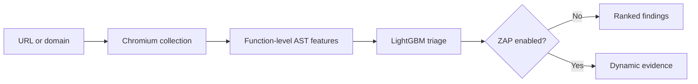

# DOM XSS Pipeline

[](https://github.com/Layansabha/DOM-XSS/actions/workflows/ci.yml)
[](LICENSE)

A containerized pipeline for prioritizing potential DOM-based XSS in a page or
bounded same-origin crawl. It renders the target in Chromium, collects the
JavaScript observed by the browser, ranks function-level code with LightGBM,
and can optionally use OWASP ZAP for authorized dynamic verification.

The machine-learning stage is a triage layer. A score helps prioritize review;
it does not prove exploitability or prove that a page is safe.

[Quick start](#quick-start) ·
[Using the scanner](#using-the-scanner) ·
[How it works](docs/PIPELINE.md) ·
[Model and research](docs/MODEL-AND-RESEARCH.md) ·
[Usage guide](docs/USAGE.md) ·
[Optional VPS Terraform](infra/terraform/README.md)

> Use this project only on systems you own or are explicitly authorized to test.

## Pipeline



## What it does

- Accepts one page or performs a bounded same-origin crawl.
- Collects scripts from the response, rendered DOM, event handlers, loaded
  resources, and Chromium script events.
- Splits JavaScript into bounded function-sized units and converts them into
  AST-token frequencies.
- Applies the pinned 500-feature vocabulary and native LightGBM model from
  [`Layansabha/Dom-xss-ML`](https://github.com/Layansabha/Dom-xss-ML).
- Refuses to score units with zero vocabulary coverage.
- Optionally runs OWASP ZAP for authorized dynamic verification.
- Runs scans asynchronously with Redis and RQ and exposes progress through a
  web UI and REST API.

## Quick start

Requirements:

- Docker Engine with Docker Compose v2
- Git and OpenSSL
- at least 6 GB of available RAM when ZAP is enabled

On Kali Linux:

```bash
sudo apt update
sudo apt install -y docker.io docker-compose git openssl
sudo systemctl enable --now docker
sudo usermod -aG docker "$USER"
newgrp docker

git clone https://github.com/Layansabha/DOM-XSS.git
cd DOM-XSS
cp .env.example .env
openssl rand -hex 32
```

Place the generated value in `.env` as `ZAP_API_KEY`, then run:

```bash
docker compose up --build -d
curl -fsS http://127.0.0.1:8000/readyz
```

Open `http://127.0.0.1:8000`.

## Using the scanner

| Mode | Behavior |
|---|---|
| `Auto` | Treats a root URL as a domain scan and a URL with a path as one page. |
| `Domain crawl` | Follows safe same-origin links within page and depth limits. |
| `Single page` | Analyzes only the submitted page. |

Leave ZAP disabled for ML-only triage. Enable it only for a target you are
authorized to test. The REST API is available under `/api`, with interactive
documentation at `/docs`.

## Reading results

| Result | Interpretation |
|---|---|
| **ML score** | Relative ranking for the highest-scoring code unit, not exploit probability. |
| **High priority** | The score crossed `ML_THRESHOLD` and should be reviewed or dynamically tested. |
| **Feature coverage** | Share of extracted AST-token occurrences represented in the model vocabulary. |
| **Insufficient coverage** | No code unit had a meaningful vocabulary match, so no ML decision was made. |
| **Client-side detection** | Browser-side evidence that still requires analyst reproduction. |
| **Actively confirmed** | The configured ZAP rule returned reproducible scanner evidence. |

## Optional local monitoring

Prometheus, Grafana, and cAdvisor are available as a Docker Compose override for
local container CPU, memory, and network monitoring.

Set `GRAFANA_ADMIN_PASSWORD` in `.env`, then run:

```bash
docker compose \
  -f compose.yaml \
  -f deploy/compose.observability.yaml \
  up --build -d
```

Default endpoints are the application on `127.0.0.1:8000`, Prometheus on
`127.0.0.1:9090`, and Grafana on `127.0.0.1:3000`.

This is a local monitoring setup, not a complete observability platform.
cAdvisor requires privileged read access to Docker and host metadata, so use
it only on a trusted development machine.

## DevOps scope

The repository demonstrates a focused set of practices:

- a non-root Docker image with a health check
- Docker Compose for the API, worker, Redis, and ZAP services
- GitHub Actions for linting, type checks, tests, dependency auditing,
  Terraform validation, Compose validation, container scanning, image building,
  and publishing to GitHub Container Registry
- optional local container monitoring with Prometheus, Grafana, and cAdvisor
- an optional Terraform reference for a single Hetzner VPS

The Terraform configuration creates billable Hetzner resources when applied.
It is a single-server deployment reference, not a highly available platform.

## Security controls

- URL normalization, DNS resolution, redirect validation, and browser-request
  checks
- private, loopback, reserved, link-local, and metadata-style target blocking
  by default
- same-origin crawl boundaries and page, depth, byte, queue, and time limits
- a non-root application container and API request-size limits
- commit-pinned model artifacts with SHA verification and no pickle
  deserialization
- CI checks with Ruff, mypy, pytest, pip-audit, Terraform validation, Compose
  validation, and Trivy image scanning

For an authorized local lab, set `ALLOW_PRIVATE_TARGETS=true`. Do not enable
that setting on a public deployment.

## Model and research basis

The project is based on the function-level AST bag-of-words approach described
in the WWW 2021 paper *Towards a Lightweight, Hybrid Approach for Detecting DOM
XSS Vulnerabilities with Machine Learning* and the related CMU DOM XSS dataset.

The deployed classifier is Layan Sabha's LightGBM derivative. It is not the
paper's TensorFlow DNN and does not claim to reproduce the paper's full
web-scale experiment. See
[`docs/MODEL-AND-RESEARCH.md`](docs/MODEL-AND-RESEARCH.md) for the evaluation,
training split, and limitations.

## Development

```bash
python3 -m venv .venv
source .venv/bin/activate
pip install -e '.[dev]'
playwright install chromium

pytest
ruff check .
mypy app
```

Makefile shortcuts include `make test`, `make lint`, `make typecheck`,
`make audit`, `make monitor-up`, and `make monitor-down`.

## Current limitations

- Standard Chromium and Tree-sitter do not reproduce the study's modified
  Chromium/V8 instrumentation byte for byte.
- The current model was trained on a cleaned sample rather than the complete raw
  dataset release.
- Authenticated crawling and custom interaction scripts are not implemented.
- Headless-browser blocking and unvisited interaction-dependent paths can
  reduce coverage.
- Automated ML and dynamic analysis can produce false positives and false
  negatives.

## License

The application is released under the [MIT License](LICENSE). Model and dataset
sources remain attributed to their respective repositories and publication.
