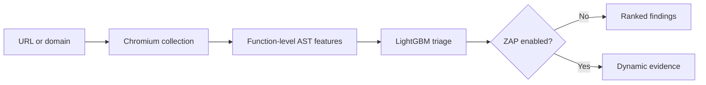

# DOM XSS Pipeline

[](https://github.com/Layansabha/DOM-XSS/actions/workflows/ci.yml)
[](LICENSE)

An end-to-end pipeline for prioritizing potential DOM-based XSS in a page or
same-origin domain. It renders the target in Chromium, collects the JavaScript
the browser sees, ranks function-level code with LightGBM, and can run OWASP
ZAP for dynamic verification.

The machine-learning stage is a fast triage layer. It narrows the code that
deserves attention; it does not claim that a score alone proves
exploitability.

[Quick start](#quick-start) ·
[Using the scanner](#using-the-scanner) ·
[How it works](docs/PIPELINE.md) ·
[Model and research](docs/MODEL-AND-RESEARCH.md) ·
[Free local Terraform](infra/terraform/local/README.md) ·
[Optional cloud Terraform](infra/terraform/README.md) ·
[Full user guide](docs/USAGE.md)

> Use this project only on systems you own or are explicitly authorized to test.

## Why this project exists

DOM XSS is created by client-side data flows, so downloading HTML and searching
for sink names is not enough. A useful pipeline needs to execute the page,
observe dynamically parsed JavaScript, analyze code at the same function-level
granularity used during model training, and keep ML suspicion separate from
dynamic evidence.

This project brings those stages into one reproducible workflow:



## What it does

- Accepts a single page or performs a bounded, same-origin crawl.
- Collects scripts from the original response, rendered DOM, event handlers,
  loaded resources, and Chromium `Debugger.scriptParsed` events.
- Captures runtime-created sources such as `eval` and `new Function` when the
  browser parses them during the visit.
- Splits JavaScript into bounded function-sized units and converts each unit
  into AST-token frequencies.
- Applies the pinned 500-feature vocabulary and native LightGBM model from
  [`Layansabha/Dom-xss-ML`](https://github.com/Layansabha/Dom-xss-ML).
- Refuses to score units with zero vocabulary coverage.
- Optionally runs OWASP ZAP Client Spider and active DOM-XSS rule `40026`.
- Runs scans asynchronously through Redis/RQ and publishes progress through a
  web UI and REST API.

## Quick start

Requirements:

- Docker Engine with Docker Compose v2
- at least 6 GB of available RAM when ZAP is enabled
- Git and OpenSSL

On Kali Linux:

```bash
sudo apt update
sudo apt install -y docker.io docker-compose git openssl
sudo systemctl enable --now docker
sudo usermod -aG docker "$USER"
newgrp docker
```

Start the application:

```bash
git clone https://github.com/Layansabha/DOM-XSS.git
cd DOM-XSS
cp .env.example .env
openssl rand -hex 32
```

Place the generated value in `.env` as `ZAP_API_KEY`, then run:

```bash
docker compose up --build -d
curl -fsS http://127.0.0.1:8000/readyz
```

Open [http://127.0.0.1:8000](http://127.0.0.1:8000).

The first startup downloads Chromium, ZAP, Redis, application dependencies,
and pinned model artifacts. Later startups reuse the local images.

### Free Terraform deployment with observability

The recommended DevOps demonstration is the fully local Terraform stack. It
uses the same Compose application, generates local secrets outside Terraform
state, and adds Prometheus, Grafana, cAdvisor, persistent monitoring data, and
a provisioned container dashboard without creating cloud resources.

```bash
cp infra/terraform/local/terraform.tfvars.example \
  infra/terraform/local/terraform.tfvars
make tf-local-plan
make tf-local-apply
```

Default endpoints are the application on `127.0.0.1:8000`, Prometheus on
`127.0.0.1:9090`, and Grafana on `127.0.0.1:3000`. See the
[free local deployment guide](infra/terraform/local/README.md) for lifecycle,
configuration, security scope, and teardown instructions.

## Using the scanner

Enter a complete HTTP(S) URL and select a scope:

| Mode | Behavior |
|---|---|
| `Auto` | A root URL is treated as a domain scan; a non-root path is treated as one page. |
| `Domain crawl` | Follows safe same-origin links within page and depth limits. |
| `Single page` | Analyzes only the submitted URL. |

Leave ZAP unchecked for ML-only triage. Enable it only for an authorized target
when dynamic verification is required; active scanning sends test payloads and
takes longer.

The same workflow is available through the API:

```bash
curl -sS -X POST http://127.0.0.1:8000/api/scans \
  -H 'Content-Type: application/json' \
  -d '{
    "target_url": "https://example.com/path",
    "scope_mode": "page",
    "dynamic_verification": false
  }'
```

The response contains a `status_url` that returns job progress and the final
result. Interactive API documentation is available at `/docs`.

See the [complete user guide](docs/USAGE.md) for polling, configuration,
troubleshooting, local-lab scanning, and VPS deployment.

## Reading the result correctly

| Result | Interpretation |
|---|---|
| **ML score** | Relative risk ranking for the highest-scoring code unit; not a calibrated exploit probability. |
| **High priority** | The score crossed `ML_THRESHOLD` and should be reviewed or dynamically tested. |
| **Feature coverage** | Share of extracted AST-token occurrences represented in the model vocabulary. |
| **Insufficient coverage** | No code unit had a meaningful vocabulary match, so no ML decision was made. |
| **Client-side detection** | ZAP browser-side evidence that still requires analyst reproduction. |
| **Actively confirmed** | ZAP active rule `40026` returned reproducible scanner evidence. |

A low score does not prove the page is safe. A high score without dynamic
evidence is a triage finding, not a confirmed vulnerability.

## Model and research basis

The project is based on the function-level AST bag-of-words idea introduced in
the WWW 2021 paper
[Towards a Lightweight, Hybrid Approach for Detecting DOM XSS Vulnerabilities with Machine Learning](https://www.contrib.andrew.cmu.edu/~liminjia/research/papers/www2021-dom-xss-dnn.pdf)
and its
[CMU DOM XSS dataset](https://kilthub.cmu.edu/articles/dataset/DOM_XSS_Web_Vulnerability_Dataset/13870256).

The deployed classifier is Layan Sabha's LightGBM derivative. It is not the
paper's TensorFlow DNN and does not claim to reproduce the paper's full
web-scale experiment. Training uses a deterministic script-level split, a
vocabulary fitted on training data only, duplicate/conflict removal, and a
strict test containing feature bags unseen by training or validation.

| Threshold | Precision | Recall | F1 | PR-AUC |
|---|---:|---:|---:|---:|
| Validation-selected `0.96085` | 0.9545 | 0.7636 | 0.8485 | 0.9066 |
| Runtime triage `0.50` | 0.8431 | 0.7818 | 0.8113 | 0.9066 |

These are function-level results on the cleaned sampled derivative dataset,
not page-level accuracy on the public web. The runtime uses `0.50` as a
recall-oriented triage threshold before optional ZAP analysis.

The [model and research audit](docs/MODEL-AND-RESEARCH.md) documents what
matches the study, what intentionally differs, and what still needs validation
before making a commercial accuracy claim.

## Deployment and security

The default Compose stack binds the application to localhost and does not
publish Redis or the ZAP API. The production override adds Caddy, automatic
HTTPS, and basic authentication for a VPS.

The [free local Terraform stack](infra/terraform/local/README.md) manages the
Compose lifecycle and adds loopback-only Prometheus and Grafana endpoints with
cAdvisor container metrics. It uses only local open-source tooling and keeps
runtime secrets outside Terraform state.

The [optional cloud Terraform stack](infra/terraform/README.md) provisions a
Hetzner Cloud VPS, restricted firewall, managed SSH key, and secure cloud-init
bootstrap. Applying that stack creates billable cloud resources; it is not
required for the local deployment.

Security controls include:

- URL normalization, DNS resolution, redirect validation, and browser-request
  checks
- private, loopback, reserved, link-local, and metadata-style target blocking
  by default
- same-origin crawl boundaries and conservative destructive-link filtering
- page, depth, byte, queue, and scan-time limits
- a non-root application container and API request-size limits
- immutable model provenance with SHA verification and no pickle
  deserialization
- CI unit tests, Ruff, mypy, dependency auditing, Terraform tests, Compose
  validation, Trivy image scanning, SBOM, and provenance attestation

For an authorized local lab, set `ALLOW_PRIVATE_TARGETS=true`. Do not enable
that setting on a public deployment.

## Repository guides

| Guide | Purpose |
|---|---|
| [Use the pipeline](docs/USAGE.md) | Exact Kali, UI, API, VPS, result, and troubleshooting steps. |
| [How the pipeline works](docs/PIPELINE.md) | Technical flow from URL validation through ZAP evidence. |
| [Model and research compatibility](docs/MODEL-AND-RESEARCH.md) | Evidence-backed comparison with the CMU study and model limitations. |
| [Free local infrastructure](infra/terraform/local/README.md) | Zero-cost Terraform lifecycle, monitoring, dashboards, and teardown. |
| [Optional cloud infrastructure](infra/terraform/README.md) | Hetzner VPS, firewall, Docker bootstrap, and teardown reference. |
| [Security policy](SECURITY.md) | Supported versions and responsible vulnerability reporting. |

## Development

```bash
python3 -m venv .venv
source .venv/bin/activate
pip install -e '.[dev]'
playwright install chromium

pytest
ruff check .
mypy app
```

The same checks are available as `make test`, `make lint`, `make typecheck`,
and `make audit`.

Model artifacts are fetched from a commit-pinned source during the image build
and verified before installation. To prepare them for local development:

```bash
ARTIFACT_DIR=artifacts python3 scripts/prepare_artifacts.py
```

## Current limitations

- Standard Chromium plus Tree-sitter cannot reproduce the study's modified
  Chromium 57/V8 taint instrumentation byte for byte.
- The current model was trained on a cleaned sample; retraining from the raw
  CMU `.xz` release remains the preferred dataset revision.
- Authenticated crawling and custom interaction scripts are not implemented.
- Headless-browser blocking and unvisited interaction-dependent paths can
  reduce coverage.
- Automated ML and ZAP analysis can produce both false positives and false
  negatives.

## License

The application is released under the [MIT License](LICENSE). Model and dataset
provenance remain attributed to their respective source repositories and
research publication.
