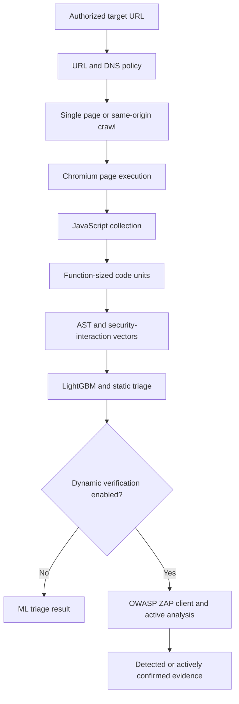

# How the pipeline works

[README](../README.md) · [Use the pipeline](USAGE.md) · [Model and research](MODEL-AND-RESEARCH.md)

## 1. Target validation

The API normalizes the submitted URL and resolves its host before queueing the
scan. Loopback, private, link-local, reserved, and metadata-style destinations
are rejected unless `ALLOW_PRIVATE_TARGETS=true`. Browser requests and
redirects are checked again to reduce SSRF and DNS-rebinding exposure.

## 2. Scope selection

`page` collects one page. `domain` performs a breadth-first crawl limited by
`MAX_PAGES` and `MAX_CRAWL_DEPTH`. Only same-origin HTTP(S) links are accepted.
Fragments are removed, duplicate URLs are skipped, and destructive or binary
paths such as logout, delete, archives, documents, and media are excluded.

In `auto`, a root URL is treated as a domain target and a URL with a non-root
path is treated as a page target.

## 3. Browser execution and JavaScript collection

Playwright loads each page in Chromium with JavaScript enabled. Collection
combines four views because no single view is complete:

1. **Original response HTML** preserves inline and external `<script>` nodes
   that runtime DOM mutation may remove.
2. **Rendered DOM** captures live `<script>` elements, event attributes such
   as `onclick`, and `javascript:` URLs.
3. **Chromium Debugger events** capture source code parsed by V8 during the
   visit, including dynamically created code from mechanisms such as `eval`
   and `new Function`.
4. **Loaded script resources** cover script requests visible in browser
   performance entries when source was not already captured.

Duplicate sources are collapsed. Runtime source is preferred over refetching
the same URL. Page, script, and request-size limits bound memory and scan time.

This is deliberately closer to the research data collection than parsing
HTML alone, but it does not add taint tracking to Chromium and cannot observe
code paths that the visit never loads or creates.

## 4. Code segmentation

Tree-sitter parses the collected JavaScript. Function declarations,
expressions, arrow functions, generator functions, and methods become
individual code units. Inline DOM handlers and `javascript:` URLs are also
individual units. Executable top-level statements are retained as bounded
fallback units so that unwrapped page code is not silently lost.

Units are deduplicated and capped by `ML_MAX_CODE_UNITS` and
`ML_MAX_CODE_UNIT_BYTES`.

## 5. Feature extraction

Each unit becomes a term-frequency dictionary derived from its JavaScript AST.
The extractor counts normalized:

- variable, method, and property names
- literal categories
- function calls and assignments
- JavaScript operators

The extractor then adds deterministic indicators for recognized untrusted
sources, dangerous sinks, and their co-occurrence within the same code unit.
Examples include URL data with `innerHTML`, storage data with `eval`, and
message data with `document.write`. These are syntactic co-occurrences, not
taint-flow proof.

Only terms present in the pinned 4,096-feature train-only vocabulary enter the
vector. The vocabulary index is the model feature index, so vector order is
stable and checked against `Booster.num_feature()` at startup.

Units with zero vocabulary matches are not passed to LightGBM. This prevents
the model's baseline output from being shown as if it came from meaningful
source-code evidence.

## 6. ML inference

LightGBM scores each scorable unit independently. The page result uses the
maximum unit score because the model was trained at function level, not page
level. The output also contains coverage, unit counts, the riskiest unit type,
matched terms, and any source/sink signals.

The runtime exposes two related decisions:

- `model_high_priority` means the learned score crossed `ML_THRESHOLD`.
- `high_priority` means the model crossed the threshold, a recognized
  source/sink pair occurred in one code unit, or both.

`decision_basis` states which path raised the priority. The second path improves
recall on obvious patterns the learned score can miss, but it is a static rule
and may flag sanitized code. Neither decision turns the score into a calibrated
probability or a confirmed vulnerability.

## 7. Optional dynamic verification

When the optional ZAP Compose override is running, the UI allows an authorized
user to request client-side exploration and the DOM-XSS-focused active rule
`40026` against collected in-scope pages. The API rejects dynamic-verification
requests when that service is not enabled. Client-side detections are separated
from actively confirmed alerts in both the API and UI.

ZAP complements ML; it does not make either stage complete. Authentication,
rare user interactions, and paths not reached by the crawler can still be
missed.

## 8. Result semantics

The pipeline has three evidence levels:

| Level | Meaning |
|---|---|
| Model low/high priority | Static function-level ranking from learned AST-token and interaction patterns. |
| Source/sink priority | Syntactic co-occurrence that requires analyst flow and sanitizer review. |
| ZAP client-side detection | Dynamic browser-side evidence requiring analyst reproduction. |
| ZAP actively confirmed | Active scanner evidence from DOM-XSS rule `40026`. |

Only the last level is labeled actively confirmed. None of the levels should
be interpreted as a guarantee that every DOM-XSS vulnerability was found.
